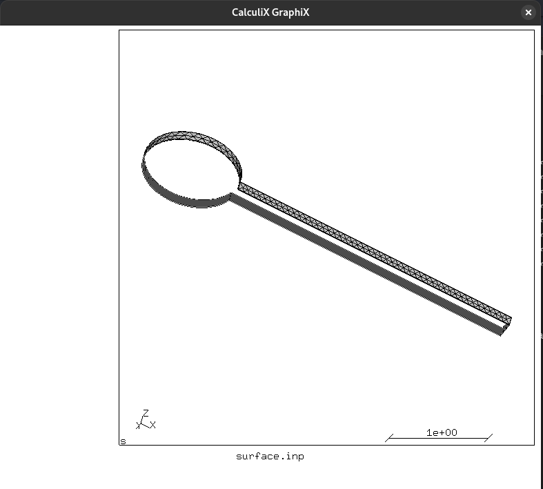
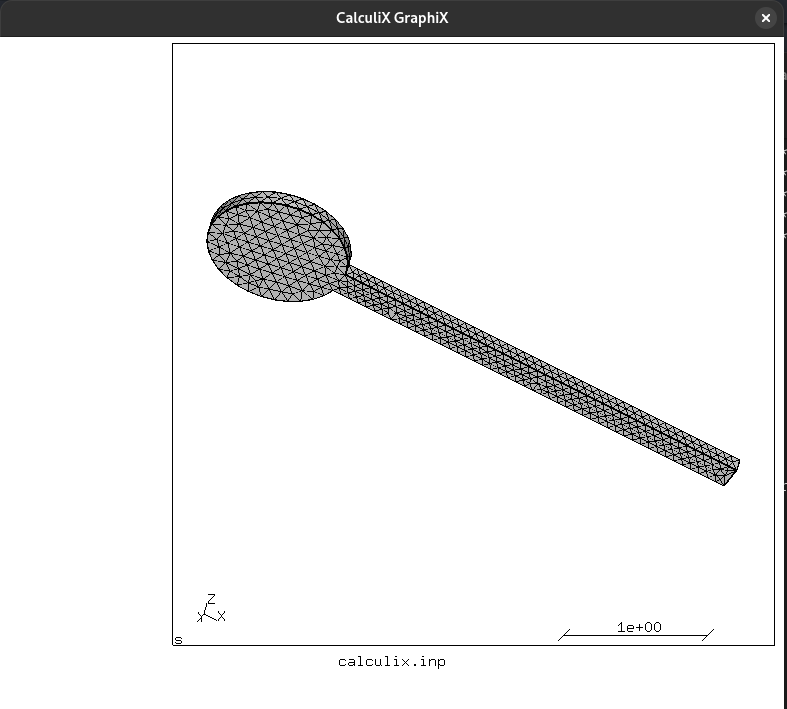
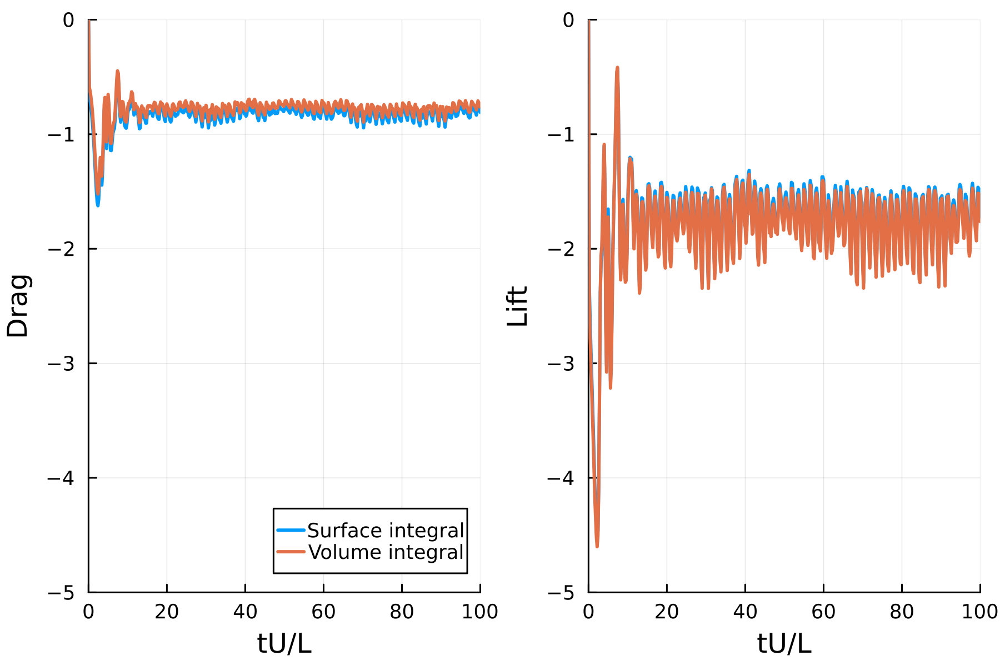

# WaterLily-PreCICE

[WaterLily.jl](https://github.com/WaterLily-jl/WaterLily.jl) bindings to connect to the [PreCICE](https://precice.org) coupling library

## Prerequisites

Before running any coupled simulation using `WaterLily.jl` and any other package with an excisting preCICE adapter, you will need a working version of preCICE, see [here](https://precice.org/installation-overview.html) for a detailed installation guide.

## Usage

This package is a work in progress and is not yet available in the julia package registry. To use it, clone the repository and add the package to your julia environment:

```julia
] dev /path/to/WaterLilyPreCICE.jl
] instantiate
```

Then, you can use the package in your julia scripts:

```julia
using WaterLilyPreCICE
```

Running the `Julia`` solvers with 

run `Julia`
```bash
julia --project=../../../ Fluid.jl ../precice-config.xml
```

run `G+Smo`
```bash
./Solid -c precice-config.xml
```

run `Calculix`
```bash
ccx_preCICE -i calculix -bg -precice-participant Calculix
```

## Approach

The approach we have to use to couple a structural solver with `WaterLily.jl` using `preCICE` is different from what you would do with classical ALE methods. Since `WaterLily.jl` is an immersed-boundary solver, there is no interface mesh readily available in the fluid solver. We follow two approaches in this package; the first one is to read the mesh as triangulated surfaces and use the `preCICE` adapter to couple this mesh to whatever type of mesh is used in the structural solver. The second approach, which can only be used if we couple to `CalculiX` or `G+Smo` is to use `preCICE` to communicate that interface mesh directly from the structural solver to the fluid solver. The limitation to this is that only 

#### General coupling

For example, in the following figure, the left side represent the surface mesh required in `WaterLily.jl` and the right side the 3D mesh required in the structural solver. `WaterLily` uses this surface mesh to immerse the geometry and compute the forces on the faces of these elements. These forces are then passed to the structural solver (in this case [CalculiX](https://www.calculix.de/)). Here, we can use a nearest neighbor interpolation in the coupling since there is an exact correspondence between nodes/elements ion the two solvers.

 Surface mesh              |  3D mesh
:-------------------------:|:-------------------------:
    |  

This is the preferred approach if you structural problem is 3D (not a shell/membrane). 

> **_NOTE:_** 
Ths approach is also the one you want to be using to couple

#### Communicating mesh internally

If you structural problem consist of membrane/shells and you are using `CalculiC` or `G+Smo`m you can directly read the mesh information from the other participant.

<!-- > **_💡 Tip:_** -->
<!-- tiptip -->

## Examples

<!-- ### Rigid Sphere in a flow

...

 -->


### Rubber Airfoil in a flow

This does not sound like a good idea, but it can actually help with gust mitigations!



### Turek-Hron FSI benchmark

A parabolic velocity profile is prescribed atr the left channel inlet
```math
u(0,y) = 1.5\bar{U}\,\frac{y(H-y)}{(\frac{H}{2})^2} = 6\bar{U}\left(\frac{y}{H}-\left(\frac{y}{H}\right)^2\right)
```
where $\bar{U}$ is the mean velocity in the channel. This profile is applied with a smnooth ramp in time
```math
u(t,0,y) = \begin{cases} u(0,y)\frac{1-\cos(\pi t/2)}{2}, & \text{if} \quad t < 2\\
u(0,y) & \text{otherwise}
\end{cases}
```

The channel and the immersed geometry have the following dimensions:

The channel and the immersed geometry have the following dimensions:

| Geometry Parameters         | Symbol | Value [m]  |
|-----------------------------|--------|------------|
| Channel Length              | $L$    | 2.5        |
| Channel Width               | $H$    | 0.41       |
| Cylinder Center Position    | $C$    | (0.2, 0.2) |
| Cylinder Radius             | $r$    | 0.05       |
| Elastic Structure Length    | $l$    | 0.35       |
| Elastic Structure Thickness | $h$    | 0.02       |
| Reference Point (at $t = 0$)| $A$    | (0.6, 0.2) |
| Reference Point             | $B$    | (0.2, 0.2) |


The FSI cases have the following parameters, see [here](https://wwwold.mathematik.tu-dortmund.de/lsiii/cms/papers/TurekHron2006.pdf)

| Parameter                       | FSI 1           | FSI 2           | FSI 3           |
|---------------------------------|-----------------|-----------------|-----------------|
| $\nu_s$                         | 0.4             | 0.4             | 0.4             |
| $\beta=\frac{\rho_s}{\rho_f}$   | 1               | 10              | 1               |
| $Ae=\frac{E}{\rho_f \bar{U}^2}$ | $3.5\times10^4$ | $1.4\times10^3$ | $1.4\times10^3$ |
| $Re =\frac{\bar{U}d}{\nu_f} $   | 20              | 100             | 200             |


...

<!-- ### Lumped model interface -->

### Contributing

We always appreciate new contributions, so please submit a pull request with your changes and help us make this adapter better!

Of course, ideas, suggestions, and questions are welcome too! Please raise an issue to address any of these.

### Citing

